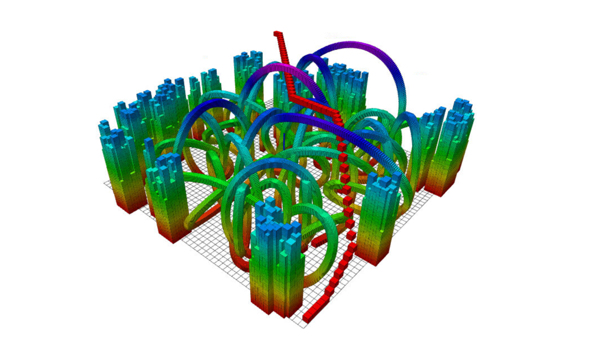
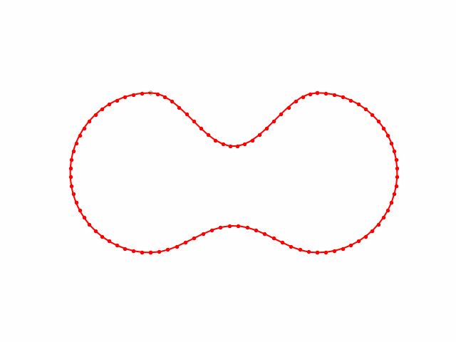

# ELEC 3210 Course Material

The repository contains 3 projects and some demos. Projects are the assignments and parts of assesments of the course. TA [@Jason-xy](https://github.com/Jason-xy/) provided the [original project materials](https://github.com/Jason-xy/elec3210-lab). The demos is the implementation of some algorithms taught in class or some other mobile robot related algorithms.

## Projects

### [Project1 - ICP Odometry](./project1_icp_odom/)

    

### [Project2 - EKF SLAM](./project2_ekf_slam/)

- **Blog**: [zhangzrjerry.github.io/blog/2024/10/21/ekf-slam](https://zhangzrjerry.github.io/blog/2024/10/21/ekf-slam/)

    

### [Project3 - A Star](./project3_a_star/)

    

## Demos

### [Demo1 - Harris Corner](./demo1_harris_corner/)

    

### [Demo2 - SIFT + RANSAC](./demo2_sift+ransac/)

    

### [Demo3 - Cubic Spline](./demo3_cubic_spline/)

- **Blog**: [zhangzrjerry.github.io/blog/2024/10/22/cubic-spline](https://zhangzrjerry.github.io/blog/2024/10/22/cubic-spline/)

    

### [Demo4 - Model Predict Control based on PHR ALM](./demo4_mpc_alm/)

- **Blog**: [zhangzrjerry.github.io/blog/2024/10/28/trajectory-tracking-task](https://zhangzrjerry.github.io/blog/2024/10/28/trajectory-tracking-task/)
- **Debug Diary**: [zhangzrjerry.github.io/blog/2024/10/29/mpc--phr-debug-note](https://zhangzrjerry.github.io/blog/2024/10/29/mpc--phr-debug-note/)

    

## Environment Prepare

- for ros: [readme_ros.md](./readme_project.md)
- for 3d: [readme_3d.md](./readme_3d.md)
- for ipynb: jupyter