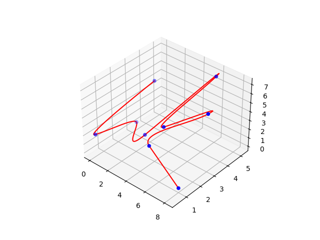

# ELEC 3210 Course Material

The repository contains 3 projects and some demos. TA [@Jason-xy](https://github.com/Jason-xy/) provided the project materials. The demos is the implementation of some algorithms taught in class or some other mobile robot related algorithms.

## Projects

### [Project1 - ICP Odometry](./project1_icp_odom/)

    

### [Project2 - EKF SLAM](./project2_ekf_slam/)

- **Blog**: [https://zhangzrjerry.github.io/blog/2024/10/21/ekf-slam](https://zhangzrjerry.github.io/blog/2024/10/21/ekf-slam-%E8%B0%83%E5%8F%82%E5%B0%8F%E8%AE%B0/)

    

### Project3 - A*

## Demos

### [Demo1 - Harris Corner](./demo1_harris_corner/)

    

### [Demo2 - SIFT + RANSAC](./demo2_sift+ransac/)

    

### [Demo3 - Cubic Spline](./demo3_cubic_spline/)

    

## Environment Prepare

- for ros: [readme_ros.md](./readme_project.md)
- for 3d: [readme_3d.md](./readme_3d.md)
- for ipynb: jupyter